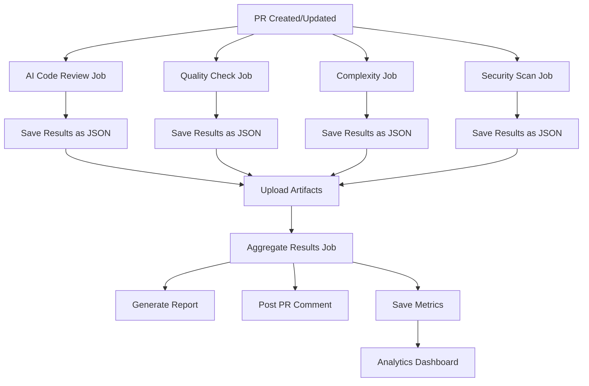

# 📊 Comprehensive Review Reports & Analytics

## Overview

The AI Code Review system now provides **comprehensive issue tracking and analytics** across all review tools, giving you complete visibility into code quality with:

1. **Aggregated Issue Lists** - All findings from all tools in one unified PR comment
2. **Downloadable Reports** - Detailed review reports as workflow artifacts
3. **Analytics Dashboard** - Interactive dashboard tracking metrics over time

## 🎯 Features

### 1. Comprehensive PR Comments

Every pull request receives a **unified review comment** that aggregates findings from:
- ✅ AI Code Review (centralized service)
- ✅ Static Analysis (Pylint, Flake8)
- ✅ Complexity Analysis (Radon)
- ✅ Security Scanning (Trivy)

**What's included:**
- **Total issue count** across all sources
- **Severity breakdown** (🚨 Critical, ❌ Error, ⚠️  Warning, 💡 Info)
- **Top 10 issues** with file locations
- **Status indicators** for each severity level
- **Links** to full report and workflow run

**Example PR Comment:**
```markdown
## 🤖 Comprehensive Code Review

**Total Issues:** 15

### 📊 Issues Breakdown

| Severity | Count | Status |
|----------|-------|--------|
| 🚨 Critical | 2 | ❌ Must fix |
| ❌ Error | 5 | ⚠️  Should fix |
| ⚠️  Warning | 6 | ⚡ Review recommended |
| 💡 Info | 2 | 📝 Optional improvements |

### 🔍 Top Issues by Category

- 🚨 **dags/pipeline.py:45** - Hardcoded credential detected
- ❌ **dags/etl.py:127** - Undefined variable reference
- ⚠️  **dags/transform.py:89** - High cyclomatic complexity: 15
...
```

### 2. Downloadable Review Reports

After each review, a **detailed markdown report** is generated and saved as a workflow artifact.

**Report Contents:**

#### Executive Summary
- Total issues found
- Issues by severity (table)
- Issues by source (table)

#### Detailed Issue List
Organized by severity level, then by category:
```markdown
### 🚨 Critical Issues (2)

#### SECURITY
- **containers/airflow/Dockerfile:12**
  Password hardcoded in environment variable `[secret-detection]`
  
- **dags/api_client.py:45**
  SQL injection vulnerability `[CWE-89]`

### ❌ Errors (5)

#### PYLINT
- **dags/pipeline.py:127**
  Undefined variable 'data_frame' `[E0602]`
...
```

#### Review Tools Used
- List of all analysis tools that ran
- Tool versions and configurations

**How to Access:**

1. **Via GitHub Actions UI:**
   ```
   PR → Checks → AI Code Review → Artifacts → code-review-report
   ```

2. **Via GitHub CLI:**
   ```bash
   gh run download <run-id> -n code-review-report
   ```

3. **Retention:** Reports are kept for **90 days**

### 3. Analytics Dashboard

An **interactive analytics dashboard** tracks code quality metrics over time.

**Location:** `/analytics/review-dashboard.html` in the repository

**Dashboard Sections:**

#### 📈 Visualizations (8 charts)

1. **Total Issues Over Time**
   - Line chart showing issue trends across PRs
   - Helps identify quality improvements or regressions

2. **Issues by Severity**
   - Pie chart of critical/error/warning/info distribution
   - Shows where to focus effort

3. **Issues by Source**
   - Bar chart comparing AI Review, Static Analysis, Complexity, Security
   - Reveals which tools catch most issues

4. **Critical Issues Trend**
   - Time series of critical issues only
   - Monitors highest-priority problems

5. **Average Issues per PR**
   - Weekly aggregated averages
   - Tracks team improvement over time

6. **Review Quality Score**
   - 0-100 score based on issue count
   - Higher score = better quality

7. **Top Issue Categories**
   - Grouped by source type
   - Identifies systematic problems

8. **Weekly Review Activity**
   - Number of reviews per week
   - Shows team productivity

#### 📊 Key Metrics Cards

At the top of the dashboard:
- **Total Reviews** - Number of PRs analyzed
- **Total Issues** - Cumulative issues found
- **Avg Issues/PR** - Average issues per pull request
- **Quality Score** - Overall quality percentage

#### 🔍 Insights Section

Automatically generated insights:
- Critical issue frequency
- Most active review weeks
- Best quality PRs
- Tool effectiveness comparison

**How to View:**

1. **In Repository:**
   Navigate to `/analytics/review-dashboard.html` and download

2. **Via GitHub Pages** (if enabled):
   ```
   https://<username>.github.io/<repo>/analytics/review-dashboard.html
   ```

3. **Via Artifacts:**
   Actions → Review Analytics Dashboard → Download artifact

**Update Frequency:**
- ✅ After each PR review (data collection)
- ✅ Weekly rebuild (Mondays at 00:00 UTC)
- ✅ Manual trigger (via workflow_dispatch)

## 🔄 Workflow Integration

### How It Works



### Jobs Overview

#### Job 1-4: Individual Reviews
Each review tool runs independently:
- Analyzes code changes
- Generates findings
- Saves results in standardized JSON format
- Uploads artifacts

#### Job 5: Aggregation
Runs after all reviews complete:
- Downloads all artifacts
- Merges results into unified format
- Generates comprehensive report
- Posts PR comment
- Saves metrics for dashboard

#### Separate: Analytics Dashboard
Weekly or on-demand:
- Collects historical metrics
- Generates interactive visualizations
- Commits dashboard to repository

## 📋 Data Format

All review results use a **standardized JSON schema**:

```json
{
  "source": "AI Review",
  "total_issues": 10,
  "summary": "Review completed successfully",
  "issues": [
    {
      "file": "dags/pipeline.py",
      "line": 45,
      "severity": "critical",
      "message": "Hardcoded credential detected",
      "category": "security",
      "rule": "secret-detection"
    }
  ]
}
```

**Severity Levels:**
- `critical` - Must fix before merge
- `error` - Should fix before merge
- `warning` - Review and consider fixing
- `info`/`suggestion` - Optional improvements

**Sources:**
- `AI Review` - Centralized AI service
- `Static Analysis` - Pylint/Flake8
- `Complexity Analysis` - Radon
- `Security Scan` - Trivy

## 🎯 Using the Reports

### For Developers

**Before Submitting PR:**
1. Check analytics dashboard for team quality standards
2. Aim for quality score above team average
3. Review common issue categories your PRs usually have

**After Review:**
1. Read the comprehensive PR comment for overview
2. Download full report for detailed analysis
3. Address critical and error issues first
4. Consider warnings and suggestions

**Tracking Progress:**
1. Compare your PRs over time via dashboard
2. Monitor your quality score improvement
3. Learn from PRs with high quality scores

### For Team Leads

**Quality Monitoring:**
1. Review dashboard weekly for trends
2. Identify quality degradation early
3. Take action when critical issues increase

**Team Performance:**
1. Compare issue rates across team members
2. Identify training opportunities
3. Celebrate quality improvements

**Process Improvement:**
1. Analyze which tools find most valuable issues
2. Adjust review configuration based on findings
3. Set quality thresholds based on metrics

### For Stakeholders

**Reporting:**
1. Export metrics from dashboard for presentations
2. Show quality trends to demonstrate improvements
3. Use data to justify tooling investments

**Compliance:**
1. Track security issue trends
2. Demonstrate code review coverage
3. Provide audit trail via reports

## ⚙️ Configuration

### Artifact Retention

Edit retention periods in workflow files:

```yaml
# Review results: 30 days
- uses: actions/upload-artifact@v3
  with:
    retention-days: 30

# Full reports: 90 days
- uses: actions/upload-artifact@v3
  with:
    retention-days: 90

# Metrics: 365 days
- uses: actions/upload-artifact@v3
  with:
    retention-days: 365
```

### Dashboard Update Schedule

Edit cron schedule in `.github/workflows/review-analytics.yml`:

```yaml
on:
  schedule:
    # Weekly on Mondays at 00:00 UTC
    - cron: '0 0 * * 1'
```

### Report Customization

Modify the report generation script in the workflow:
- Add/remove sections
- Change formatting
- Include additional metrics
- Customize severity thresholds

## 🔗 Related Documentation

- [AI Review Guide](AI_REVIEW_GUIDE.md) - Quick reference
- [Setup Instructions](SETUP_INSTRUCTIONS.md) - Initial setup
- [Workflow README](workflows/README.md) - Technical details
- [Analytics README](../analytics/README.md) - Dashboard usage

## 📝 Best Practices

### For Maximum Value

1. **Review Reports Promptly** - Address issues while context is fresh
2. **Track Trends** - Check dashboard weekly
3. **Set Quality Goals** - Aim to improve scores over time
4. **Share Insights** - Discuss patterns in team meetings
5. **Iterate** - Adjust thresholds based on team capacity

### Common Patterns

**High Initial Issues → Gradual Improvement**
- Normal pattern as team learns standards
- Dashboard will show downward trend

**Spikes in Specific Categories**
- May indicate new feature complexity
- Or need for team training in that area

**Consistent Low Issue Count**
- Indicates strong code quality culture
- Or potentially too-lenient thresholds

## ❓ FAQ

**Q: Where can I find old review reports?**
A: Artifacts are kept for 90 days. For longer retention, download and archive reports manually, or increase retention-days in workflow.

**Q: Can I exclude certain types of issues from the report?**
A: Yes, modify the aggregation step in the workflow to filter out specific categories or severity levels.

**Q: How do I share the dashboard with external stakeholders?**
A: Enable GitHub Pages and point to `/analytics/review-dashboard.html`, or download and host it elsewhere.

**Q: What if I want daily dashboard updates?**
A: Change the cron schedule in `review-analytics.yml` to `0 0 * * *` (daily at midnight).

**Q: Can I export metrics to external systems?**
A: Yes, metrics are saved as JSON. Add a step to send them to your monitoring/analytics platform.

**Q: Does this slow down PR reviews?**
A: No, the aggregation job runs in parallel after individual reviews. Total time is roughly the same.

---

*For questions or issues, please open a GitHub issue or contact your team's DevOps lead.*
